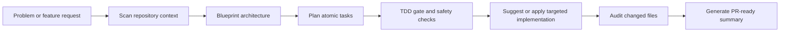
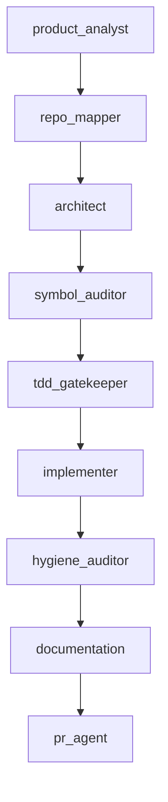
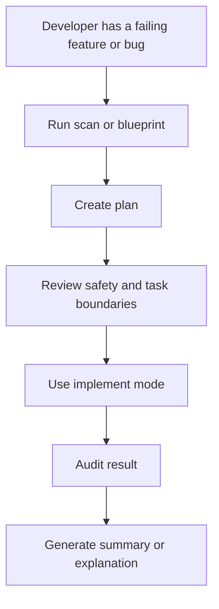
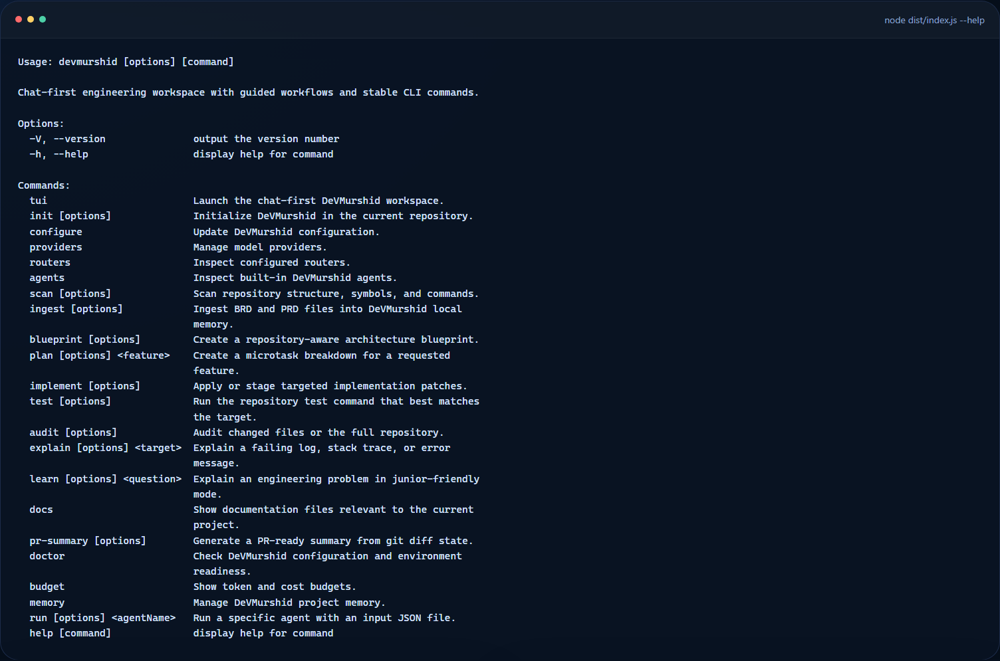
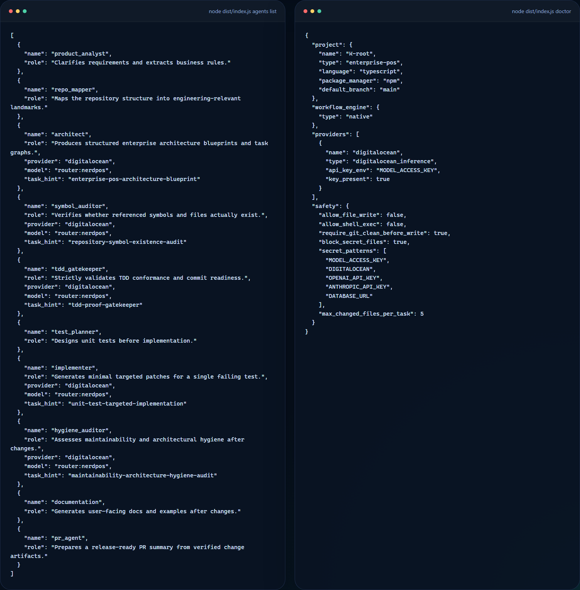

# DeVMurshid Showcase

Public-safe case study and CLI showcase for DeVMurshid, a chat-first engineering workspace for structured software delivery.

This repo is the public proof layer for the product direction. It uses real command output from the working CLI and explains the workflow shape without exposing private provider configuration, internal prompts, or implementation details that should stay out of a public portfolio surface.

## Supporting docs

- [Workspace model](docs/workspace-model.md)
- [Safety and agents](docs/safety-and-agents.md)

## What this showcase covers

- Real CLI command surface from the shipped `dist` build
- Built-in agent map and safety posture
- Product framing for blueprint, planning, implementation, audit, and learning workflows
- Public explanation of how the workspace is meant to support junior and mid-level developers

## Why this product exists

DeVMurshid is aimed at a common delivery problem:

- junior developers get stuck between raw errors and vague chat responses
- planning, implementation, and review happen in disconnected tools
- teams need stricter controls around write operations, tests, and scope size
- AI coding help becomes risky when it skips repository context and delivery discipline

## Who this is for

- junior developers who need clearer explanations and guided debugging
- mid-level developers who want faster repo-aware planning and task shaping
- tech leads who want safer write modes and cleaner delivery boundaries

## Product positioning

DeVMurshid is designed to behave like a disciplined engineering team inside the terminal:

- product analysis and requirement clarification
- repository mapping and context extraction
- architecture blueprinting and task decomposition
- symbol verification and TDD gating
- targeted implementation support
- post-change hygiene and documentation workflows

## Command families

| Command family | Purpose |
| --- | --- |
| `scan` | map repository structure, scripts, and symbols |
| `blueprint` | produce architecture-oriented breakdowns |
| `plan` | create atomic task lists for requested features |
| `implement` | suggest or apply targeted changes under tighter controls |
| `audit` | review changed files or broader repo state |
| `explain` and `learn` | help developers understand errors and concepts |
| `doctor` | inspect environment, providers, and safety settings |

## Workflow map

## Agent map

## Example usage story

## Evidence from the real CLI

### Command surface

The image below comes from the actual `node dist/index.js --help` output.

### Agents and safety posture

The image below combines two real command outputs:

- `node dist/index.js agents list`
- `node dist/index.js doctor`

It shows both the built-in agent roles and the current safety gates used by the runtime.

## What the public evidence proves

- the product already has a structured command tree rather than a vague concept README
- the workflow model is organized around concrete stages: scan, plan, implement, audit, explain
- the system includes explicit safety posture, not just productivity claims
- the agent layer is framed as role-based engineering support rather than generic chatbot branding

## Safety model visible from the public layer

The real `doctor` output shows a few important product choices:

- file writes can be restricted
- shell execution can be restricted
- a clean git state can be required before writes
- secret-like patterns are explicitly guarded
- changed-file scope can be capped per task

Those details matter because they show the product direction is about disciplined delivery, not only speed.

## What matters technically

- provider-agnostic runtime with a consistent workflow contract
- chat-first workspace paired with stable CLI commands
- safe implementation modes with approval and test gates
- explain and learn workflows oriented toward junior developers
- repository-aware planning instead of generic chatbot responses

## Public vs private boundary

Public here:

- CLI screenshots
- workflow framing
- agent or system narrative
- product positioning

Kept private by design:

- provider keys and environment values
- internal prompt assets
- fast-moving implementation details not ready for stable public release

## What can be added later

Future public-safe additions can include:

- a sanitized walkthrough of a full blueprint-to-plan session
- more captures from the interactive workspace once the UI is stable enough for public presentation
- a case study focused specifically on junior-developer learning workflows

## Related direction

- Main profile: [KareemQabil](https://github.com/KareemQabil)
- Portfolio: [kerimqabil.me](https://kerimqabil.me)
