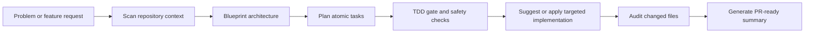
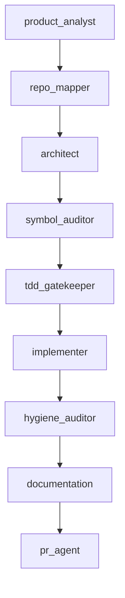

# DeVMurshid Showcase

Public-safe case study and CLI showcase for DeVMurshid, a chat-first engineering workspace for structured software delivery.

This repo is the public proof layer for the product direction. It uses real command output from the working CLI and explains the workflow shape without exposing private provider configuration, internal prompts, or implementation details that should stay out of a public portfolio surface.

## What this showcase covers

- Real CLI command surface from the shipped `dist` build
- Built-in agent map and safety posture
- Product framing for blueprint, planning, implementation, audit, and learning workflows
- Public explanation of how the workspace is meant to support junior and mid-level developers

## Product positioning

DeVMurshid is designed to behave like a disciplined engineering team inside the terminal:

- product analysis and requirement clarification
- repository mapping and context extraction
- architecture blueprinting and task decomposition
- symbol verification and TDD gating
- targeted implementation support
- post-change hygiene and documentation workflows

## Workflow map

## Agent map

## Evidence from the real CLI

### Command surface

The image below comes from the actual `node dist/index.js --help` output.

### Agents and safety posture

The image below combines two real command outputs:

- `node dist/index.js agents list`
- `node dist/index.js doctor`

It shows both the built-in agent roles and the current safety gates used by the runtime.

## What matters technically

- Provider-agnostic runtime with a consistent workflow contract
- Chat-first workspace paired with stable CLI commands
- Safe implementation modes with approval and test gates
- Explain and learn workflows oriented toward junior developers
- Repository-aware planning instead of generic chatbot responses

## Public vs private boundary

Public here:

- CLI screenshots
- workflow framing
- agent/system narrative
- product positioning

Kept private by design:

- provider keys and environment values
- internal prompt assets
- fast-moving implementation details not ready for stable public release

## Related direction

- Main profile: [KareemQabil](https://github.com/KareemQabil)
- Portfolio: [kerimqabil.me](https://kerimqabil.me)
